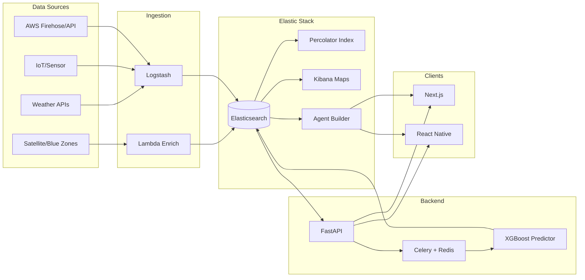

# Comprehensive Implementation Plan: Elastic Flood Early Warning System

## 1. Current State Summary

**Existing assets (boilerplate only):**

- [docker-compose.yml](c:\Users\GEYE ARDIANSYAH\Downloads\Innovation Hub\Flood-warning-Project\docker-compose.yml): Elasticsearch 8.12, Kibana, Logstash, MongoDB (no Redis/Celery).
- [elasticsearch/index-templates.ndjson](c:\Users\GEYE ARDIANSYAH\Downloads\Innovation Hub\Flood-warning-Project\elasticsearch\index-templates.ndjson): Templates for `flood-sensors-*`, `flood-boundaries-*`, `flood-predictions-*` with `geo_point` and `geo_shape`.
- [logstash/pipeline/flood-sensors.conf](c:\Users\GEYE ARDIANSYAH\Downloads\Innovation Hub\Flood-warning-Project\logstash\pipeline\flood-sensors.conf): HTTP poller for OpenWeatherMap (Queensland, Hat Yai, Sumatra), Beats, TCP; **filter block is TODO**.
- [backend/](c:\Users\GEYE ARDIANSYAH\Downloads\Innovation Hub\Flood-warning-Project\backend): FastAPI app with routers (location, boundaries, evacuation, predictions, health) and schemas defined; **all endpoints raise NotImplementedError**. [app/services/ml_predictor.py](c:\Users\GEYE ARDIANSYAH\Downloads\Innovation Hub\Flood-warning-Project\backend\app\services\ml_predictor.py) is a skeleton (XGBoost/sklearn TODOs).
- [elasticsearch/seed-data.ndjson](c:\Users\GEYE ARDIANSYAH\Downloads\Innovation Hub\Flood-warning-Project\elasticsearch\seed-data.ndjson): Sample sensors and flood boundaries for demo regions.
- **No frontend folder** yet; README references Next.js and `.env.example` has `NEXT_PUBLIC_*` vars.

**Design authority:** [Flood App_ Emergency Notification System.md](c:\Users\GEYE ARDIANSYAH\Downloads\Innovation Hub\Flood-warning-Project\Flood App_ Emergency Notification System.md) defines blue zones (Sentinel/MODIS + U-Net), sensorless prediction (XGBoost + weather APIs), Percolator for user-in-zone matching, Celery/Redis for heavy work, OpenRouteService `avoid_polygons`, and peer-to-peer SOS (Critical Alerts / FCM; no auto-dial).

---

## 2. Target Architecture

**Data flow (concise):**

- **Ingest:** Logstash (weather, Beats, TCP) + optional AWS (Kinesis Data Firehose / API Gateway) into Elasticsearch. Blue-zone polygons (precomputed or from pipeline) indexed into `flood-boundaries-*` and optionally a **Percolator index** for user geofences.
- **Store:** Elasticsearch holds sensors (`geo_point`), boundaries (`geo_shape`), predictions (`geo_point` + horizon), and percolator queries (user locations).
- **Compute:** FastAPI handles HTTP/WebSocket; Celery + Redis runs XGBoost inference and polygon generation; results written back to ES.
- **Alert:** New flood polygon percolated against stored user queries → list of affected users → push (FCM/APNs) and/or in-app alerts.
- **Evacuation:** FastAPI calls OpenRouteService (or Mapbox/GraphHopper) with `avoid_polygons` (simplified GeoJSON from ES).

---

## 3. Elastic-Centric Components (Priority)

| Component        | Purpose                                                                                                                    | Key docs / patterns                                                                                                                                                                      |
| ---------------- | -------------------------------------------------------------------------------------------------------------------------- | ---------------------------------------------------------------------------------------------------------------------------------------------------------------------------------------- |
| **Geo mappings** | Already in templates; ensure `geo_point` (sensors, users) and `geo_shape` (boundaries, blue zones).                        | [geo-point](https://www.elastic.co/guide/en/elasticsearch/reference/current/geo-point.html), [geo-shape](https://www.elastic.co/guide/en/elasticsearch/reference/current/geo-shape.html) |
| **Geo queries**  | `geo_distance`, `geo_bounding_box`, `geo_shape` (intersects) for location check and boundaries.                            | Existing examples in [index-templates.ndjson](c:\Users\GEYE ARDIANSYAH\Downloads\Innovation Hub\Flood-warning-Project\elasticsearch\index-templates.ndjson) (lines 124–163)              |
| **ES             | QL**                                                                                                                       | Use `ST_INTERSECTS(flood_boundary, point)` for “is this point in a flood zone?” in new code paths where beneficial.                                                                      |
| **Percolator**   | Index user geofence queries; when a new flood polygon is written, percolate to get list of matching user IDs for alerts.   | [Percolator + geo](https://www.elastic.co/blog/found-geo-points-and-elasticsearch-percolator), [when and how to percolate](https://www.elastic.co/blog/when-and-how-to-percolate-2)      |
| **Kibana Maps**  | Layers: `geo_point` (sensors, predictions), `geo_shape` (boundaries). Use EMS basemap or self-hosted Elastic Maps Server.  | [Kibana Maps](https://www.elastic.co/guide/en/kibana/current/maps.html), [EMS](https://www.elastic.co/guide/en/kibana/master/maps-connect-to-ems.html)                                   |
| **Anomaly / ML** | Optional: Elasticsearch ML jobs on sensor time series for anomaly detection; primary prediction remains XGBoost in Python. | [ML overview](https://www.elastic.co/guide/en/machine-learning/current/ml-ad-overview.html)                                                                                              |

---

## 3b. Elastic Agent Builder & Generative AI (Innovation Layer)

**[Elastic Agent Builder](https://www.elastic.co/elasticsearch/agent-builder)** lets you build custom AI agents that chat with users in natural language and run tools over your Elasticsearch data. For the flood EWS, this maximizes **generative AI** and **innovation** by giving residents and operators a conversational interface grounded in the same indices (sensors, boundaries, predictions) that power the map and APIs.

**Why it fits this solution:**

- **Grounded in your data:** The agent uses only your flood indices — no hallucinated risk levels; answers reflect actual boundaries, predictions, and sensor time series ([Agent Builder overview](https://www.elastic.co/elasticsearch/agent-builder)).
- **ES|QL tools with full control:** You define parameterized ES|QL tools so the agent runs exact geospatial and time-scoped queries (e.g. “flood risk at this point”, “boundaries active at this time”) with correct syntax and business rules ([ES|QL tools](https://www.elastic.co/docs/solutions/search/agent-builder/tools/esql-tools)).
- **Natural language:** Users can ask “Is my area at risk in 4 hours?”, “Where are the worst predictions near Brisbane?”, “Which zones flooded here in the past?” — the agent picks the right tool and parameters.
- **Reuse and extend:** Built-in `.execute_esql`, `.search`, and index explorer; add **custom ES|QL tools** for flood-specific patterns. Optional **MCP** server exposes these tools to other AI clients; **MCP tools** can pull in external APIs (e.g. weather) for richer answers ([MCP server](https://www.elastic.co/search-labs/blog/elastic-mcp-server-agent-builder-tools), [MCP tools](https://www.elastic.co/docs/explore-analyze/ai-features/agent-builder/tools/mcp-tools)).
- **Chat in Kibana + embed in app:** Operators use the Agent Chat in Kibana (standalone or flyout). For residents, call **POST /api/agent_builder/converse** from your backend (or via a proxy) so Next.js and React Native can show the same conversational UI in your app ([Agent Chat](https://www.elastic.co/docs/solutions/search/agent-builder/chat), [converse API](https://www.elastic.co/docs/api/doc/serverless/operation/operation-post-agent-builder-converse)).

**Suggested Agent Builder design for flood EWS:**

| Capability             | How                                                                                                                                                                                                                                      |
| ---------------------- | ---------------------------------------------------------------------------------------------------------------------------------------------------------------------------------------------------------------------------------------- |
| **Custom ES            | QL tools**                                                                                                                                                                                                                               |
| **Custom agent**       | One “Flood Early Warning Assistant” agent that uses these tools plus built-in search. System prompt: you are a flood risk assistant; answer only from the provided tool results; say when data is missing or out of range.               |
| **Chat in Kibana**     | Enable Agent Builder in Kibana; analysts and ops use natural language to explore indices, check risk at coordinates, and compare predictions.                                                                                            |
| **Chat in web/mobile** | Backend (FastAPI) proxy to Kibana `POST /api/agent_builder/converse` (with API key and kbn-xsrf). Next.js and React Native: “Ask about flood risk” panel that sends user message and displays agent reply (and optional tool citations). |
| **Optional MCP**       | Expose the flood tools via Elastic’s MCP server so other agents (e.g. in Cursor, Claude Desktop) can query flood data with the same tools.                                                                                               |
| **Optional workflows** | Use [Elastic Workflows](https://www.elastic.co/elasticsearch/agent-builder) (YAML, event-driven) to chain “user asks → agent runs ES                                                                                                     |

**Alignment with external GenAI trends:** Conversational flood interfaces (e.g. [FloodLense](https://arxiv.org/html/2401.15501v1) with ChatGPT + detection models; [H2O Flood Intelligence](https://h2o.ai/blog/2025/h2oai-flood-intelligence-blueprint-accelerated-by-nvidia/) multi-agent risk and forecasting) show strong demand. Our twist: the agent is **fully grounded in Elasticsearch** (sensors, boundaries, predictions, blue zones) with **no separate vector store** for flood data — one platform for geo, time, and GenAI.

**Stack note:** Agent Builder is available in Elastic Stack 9.2+ (preview) and 9.3+ (GA) and in Elastic Cloud Serverless. If the hackathon uses 8.x, plan the agent as “Phase 9” or document it as the upgrade path once on 9.x / Cloud Serverless.

---

## 3c. Latest technology opportunities (AI, RAG, and beyond)

These are **current technologies** that can be implemented to differentiate the solution; each is scoped as hackathon-feasible vs. post-hackathon roadmap.

**RAG (Retrieval Augmented Generation):** Retrieve relevant docs from Elasticsearch (keyword + vector + geo), then pass as context to an LLM so answers are grounded and less prone to hallucination ([Elastic RAG](https://www.elastic.co/guide/en/elasticsearch/reference/current/_retrieval_augmented_generation.html)). **Implement now:** Add a dense/semantic field to a small "flood knowledge" index; use [Inference API](https://www.elastic.co/guide/en/elasticsearch/reference/current/infer-service-elser.html) (ELSER or dense) to embed; run **hybrid search** (lexical + vector + geo) and feed top-k to an LLM. Refs: [hybrid geospatial RAG with Bedrock](https://www.elastic.co/blog/hybrid-geospatial-rag-application-elastic-amazon-bedrock), [multimodal + geospatial RAG](https://www.elastic.co/search-labs/blog/multimodal-rag-elasticsearch-geospatial).

**Hybrid search:** Combine BM25, kNN vector, and geo in one query; merge with [RRF](https://www.elastic.co/search-labs/blog/hybrid-search-elasticsearch) ([Elastic hybrid search](https://www.elastic.co/elasticsearch/hybrid-search)). **Implement now:** Single ES query with text + kNN + geo_distance/geo_shape for "search flood info near me" and RAG retrieval.

**Multimodal RAG (text + images + geo):** Index text and image embeddings (e.g. CLIP) with geo; query by text or image and filter by location. **Roadmap:** Index satellite/street flood imagery + captions + geo for "show flooded areas like this" or "photos near Hat Yai".

**Agentic hybrid search:** LLM chooses when to use geo vs. keywords vs. time ([Agentic LLM hybrid search](https://www.elastic.co/search-labs/blog/llm-agents-intelligent-hybrid-search)). **Implement now:** One "smart search" tool in Agent Builder or a FastAPI step that uses an LLM to build the hybrid ES query.

**Flood-specific AI (foundation models):** [FloodCastBench](https://www.nature.com/articles/s41597-025-04725-2) (2025) and [U-Prithvi](https://drops.dagstuhl.de/entities/document/10.4230/LIPIcs.GIScience.2025.18) / weather foundation models for flood extent. **Roadmap:** Train/fine-tune or run inference; index predicted polygons into `flood-boundaries-*`.

**Crisis RAG / knowledge graphs:** [CrisiSense-RAG](https://arxiv.org/html/2602.13239v1) (multimodal disaster impact), [E-KELL](https://www.sciencedirect.com/science/article/abs/pii/S2212420924005661) / [ResQConnect](https://www.mdpi.com/2071-1050/18/2/1014) (knowledge graph + LLM for emergency decisions). **Roadmap:** Small "flood response" knowledge base (protocols, contacts) in ES for RAG/Agent Builder to cite.

**Summary:** RAG + hybrid search + Inference API = hackathon-ready. Agent Builder (Phase 8) + one RAG/hybrid tool = strong AI story. Multimodal RAG, flood foundation models, and crisis knowledge graphs = post-hackathon differentiators.

---

## 4. AWS Integration (Stick to Elastic + AWS)

- **Elastic on AWS:** Deploy Elasticsearch + Kibana via [Elastic Cloud on AWS](https://www.elastic.co/blog/getting-started-with-elastic-cloud-on-amazon-web-services-aws) or [AWS Marketplace](https://www.elastic.co/docs/deploy-manage/deploy/elastic-cloud/aws-marketplace) for the hackathon; keep Logstash either on same VPC or use Elastic Agent to ship data to Cloud.
- **Ingestion:** For sensor/IoT streams, use **Amazon Kinesis Data Firehose** (or API Gateway) → Lambda (normalize, add geo) → HTTP to Logstash or directly to Elasticsearch (with proper auth/network). Reference: [AWS real-time flood alerts](https://aws.amazon.com/blogs/publicsector/creating-real-time-flood-alerts-cloud), [telemetry with API Gateway and Firehose](https://aws.amazon.com/blogs/big-data/ingest-telemetry-messages-in-near-real-time-with-amazon-api-gateway-amazon-data-firehose-and-amazon-location-service/).
- **Satellite/blue zones:** Preprocess (e.g., Sentinel/MODIS, U-Net/GDAL/Shapely) on **EC2 or Lambda + S3**; write GeoJSON to S3; Lambda or batch job indexes into `flood-boundaries-*` via Elasticsearch API. Optional: [Building hybrid satellite imagery workloads on AWS](https://aws.amazon.com/solutions/guidance/building-hybrid-satellite-imaging-workloads-on-aws).
- **Optional RAG/demo:** [Hybrid geospatial RAG with Elastic and Amazon Bedrock](https://www.elastic.co/blog/hybrid-geospatial-rag-application-elastic-amazon-bedrock) for “ask questions about flood risk in this area” style demo.

Do **not** replace Elasticsearch with a different search/DB for core flood data; use AWS for transport, compute, and storage of raw assets (e.g., imagery, large GeoJSON).

---

## 5. Implementation Phases

### Phase 1: Foundation (Elastic + Backend connectivity)

- **1.1** Add **Redis** (and optionally Celery worker) to `docker-compose.yml` for later async tasks and percolator-triggered alerts.
- **1.2** Complete **Logstash filter** in [flood-sensors.conf](c:\Users\GEYE ARDIANSYAH\Downloads\Innovation Hub\Flood-warning-Project\logstash\pipeline\flood-sensors.conf): parse OpenWeatherMap JSON → map `coord.lat/lon` to `location` (geo_point), `main.temp` → `temperature_c`, `rain.1h` / `main.humidity` etc. → schema; set `@timestamp` and `ingested_at`; ensure output index `flood-sensors-%{+YYYY.MM.dd}`.
- **1.3** In **FastAPI startup**: call `get_es_client()`, validate cluster health, optionally check index templates; connect MongoDB; on shutdown close ES and Mongo.
- **1.4** Wire all routers in [main.py](c:\Users\GEYE ARDIANSYAH\Downloads\Innovation Hub\Flood-warning-Project\backend\main.py) (health, location, boundaries, evacuation, predictions). Implement **GET /health** (ES + Mongo ping).

### Phase 2: Geospatial API (Elasticsearch queries)

- **2.1** **POST /location/check-location:**  
  - Query `flood-boundaries-*` with `geo_shape` (point intersects `flood_boundary`), filter `active: true`.  
  - Query `flood-sensors-*` with `geo_distance` from request lat/lon (e.g. 50 km).  
  - Optionally query `flood-predictions-*` for that area and time window.  
  - Combine into `LocationCheckResponse`: risk_level, nearest_sensor_id, water_level_m, active_boundaries, optional predicted_flood_time and evacuation_route (call evacuation logic).
- **2.2** **GET /boundaries/flood-boundaries:** Bool query with `active_only` and optional `country` term filter; support optional `include_historical` or `source=blue_zone` so mobile (and web) can request historical flood areas (blue zones) for the map layer “places that flooded in the past”. **Time-scoped:** Add optional query params `at_time` (ISO8601) or `date` + `time` so the map can show “flood at this moment”. Filter boundaries by `valid_from` ≤ `at_time` ≤ `valid_until` (and for predictions, use `predicted_for`). Return `FloodBoundaryItem` list (include `flood_boundary` as geometry in response).
- **2.3** **GET /evacuation/evacuation-routes:**  
  - Fetch flood polygons from ES (same as boundaries); **optional `at_time**` so the route avoids zones that are active at the user-selected time (consistent with time/calendar picker).  
  - Simplify polygons (Douglas–Peucker via Shapely) to stay under URL/size limits.  
  - Call **OpenRouteService** Directions API with `avoid_polygons` (GeoJSON) to get route from (lat, lon) to a safe destination (e.g. nearest low-risk sensor or predefined safe point).  
  - Return waypoints and metadata in `EvacuationRouteResponse`.
- **2.4** **GET /predictions/predictions:** Time range `now` to `now + hours_ahead` by default; **optional `at_time` (or `for_date`/`for_time`)** so the client can request “predictions valid at this chosen future date/time” — filter by `predicted_for` overlapping the selected moment so the map reflects flood risk driven by future weather for that slot. Optional `geo_distance` filter if lat/lon provided; sort by `predicted_for`, `confidence_score`; map to `PredictionItem` list.

Use **ES|QL** where it simplifies code (e.g. one-off “points in polygon” checks) and keep Query DSL for existing patterns.

### Phase 3: Percolator and real-time alerts

- **3.1** Create index for **percolator** (e.g. `flood-user-alerts`) with mapping: `query` (percolator type), optional `user_id`, `region`/`country` for routing. Register each user’s “interest” as a geo_shape or geo_distance query (e.g. point + radius or small polygon).
- **3.2** When a **new flood polygon** is written (by Celery or ingestion pipeline): percolate that document against `flood-user-alerts`; get matched query IDs (user IDs); send to notification service (FCM/APNs). Use regional/country routing to limit percolation scope.
- **3.3** FastAPI endpoint to **register/unregister** user alert area (e.g. POST body: lat, lon, radius_km or GeoJSON polygon) → build ES query → index into percolator index with user_id.

### Phase 4: ML predictions (4–6 hour horizon)

- **4.1** **Feature engineering:** From `flood-sensors-*`: water_level, rainfall_mm, wind_speed_ms, humidity_pct, plus time features (hour_of_day, day_of_week); optional lag features (t-1, t-2, t-6) if historical data available.
- **4.2** **Model:** Implement [ml_predictor.py](c:\Users\GEYE ARDIANSYAH\Downloads\Innovation Hub\Flood-warning-Project\backend\app\services\ml_predictor.py) with **XGBoost** (e.g. `XGBRegressor` for water level; map to risk_level via existing `RISK_THRESHOLDS`). Train on historical_data; persist with joblib; load on startup or on first prediction.
- **4.3** **Celery task:** Periodically (e.g. every 15–30 min) fetch latest sensor readings from ES, run `predict(horizon_hours=6)`, write results to `flood-predictions-*` with `geo_point`, `predicted_for`, `confidence_score`, `model_version`.
- **4.4** **GET /predictions** already implemented in Phase 2; ensure it reads from this index. Optional: expose a small “model status” in /health (e.g. last training time).

### Phase 5: Blue zones and enrichment (sensorless enhancement)

- **5.1** Ingest **blue zone** polygons (historical flood extents): e.g. from [Global Flood Database](https://global-flood-database.cloudtostreet.ai/) (MODIS) or preprocessed Sentinel-1/2 (U-Net) outputs. Index into `flood-boundaries-*` with `active: false` and a `source: blue_zone` (or separate index if preferred). Use for “historical risk” in location check.
- **5.2** Optional: **Weather enrichment** — Meteomatics 1 km, OpenWeatherMap One Call, or Tomorrow.io for hyperlocal precipitation; ingest via Logstash or Lambda and store in ES (e.g. same sensor index or dedicated weather index) for ML and risk scoring.

### Phase 6: Kibana Maps and dashboards

- **6.1** **Kibana Maps:** Create map with EMS basemap; add layer from `flood-sensors-*` (geo_point), layer from `flood-boundaries-*` (geo_shape), layer from `flood-predictions-*` (geo_point). Use time picker for temporal slice. Save and add to dashboard.
- **6.2** **Dashboard:** Panels for sensor count, risk distribution (aggregations), and the map; optional ML anomaly charts if using Elasticsearch ML.

### Phase 7: Frontends (Next.js + React Native)

**Time / calendar control (web + mobile):**  

- Add a **date and time picker** (calendar + time-of-day) so users can choose “when” to view flood risk. When the user changes the date/time, refetch **GET /boundaries** and **GET /predictions** with the optional `at_time` (ISO8601) query param. The map and risk layers then show flood state **for that chosen moment** — so flood view is different based on future weather (and stored predictions/boundaries valid at that time). Default to “now” with a clear “Now” / “Live” chip; allow stepping to “in 3 hours”, “tomorrow 14:00”, or a calendar date. Backend already supports time-scoped data via `valid_from`/`valid_until` and `predicted_for`.

**UI/UX: Google Maps–like quality, distinct identity:**  

- **Familiar map experience:** Smooth pan/zoom, pinch-to-zoom on mobile, clear layer controls, optional bottom sheet or slide panel for “Check my risk” and route details (similar interaction quality to Google Maps). Use standard map gestures and feedback so the app feels intuitive.  
- **Distinct design (not a clone):** Use a **different** visual identity so it doesn’t look like Google Maps: custom color palette for risk levels (e.g. blue/teal for water risk instead of Google green/red), own typography and spacing, app-specific markers and layer styling, and a clear product name/logo. Avoid copying Google’s pin styles, sheet layout, or exact colors. Goal: same level of polish and usability, but recognizably “our” flood early warning app.
- **7.1** **Next.js app** (new `frontend/`):  
  - Home: location input (lat/lon or address search) → call **POST /location/check-location**; display risk and evacuation route.  
  - **Time/calendar:** Date + time picker; pass `at_time` to GET /boundaries and GET /predictions; map and risk panels update for the selected moment (flood different based on future weather).  
  - Map: Leaflet or Mapbox GL; overlay flood boundaries and predictions (time-scoped); show evacuation polyline. Apply **distinct UI** (custom risk colors, typography, legend).  
  - Use [backend app/schemas](c:\Users\GEYE ARDIANSYAH\Downloads\Innovation Hub\Flood-warning-Project\backend\app\schemas.py) for types; `NEXT_PUBLIC_API_URL` from env.
- **7.2** **React Native app** (new `mobile/` or repo)** — full map experience with time picker and Google Maps–like UX:**
  - **Mobile map as primary view:**  
    - Full-screen map (e.g. React Native Maps / MapLibre) with user location; smooth gestures; **date/time picker** (calendar + time) so users can change when they’re viewing — flood layers update via `at_time` (future weather drives different risk at different times).  
    - **Risk layers on the map (same API as web, time-scoped):**  
      - **Active flood boundaries** (GET /boundaries with `at_time`): current or chosen-time flood zones.  
      - **Predicted risk** (GET /predictions with `at_time`): “places with big chance of flood” at the selected future time.  
      - **Historical / blue zones** (GET /boundaries, historical): areas that flooded in past events; distinct style (e.g. lighter fill).
    - **Layer toggles / legend:** Turn on/off “Current zones”, “Predicted risk”, “Historical areas”; **distinct UI** — not Google Maps look (custom palette, typography, markers).
  - **Other screens:** location permission, “Check my risk”, evacuation route (e.g. bottom sheet), alert list.  
  - **Background:** Register percolator; push via FCM/APNs; one-tap “Emergency SOS” opens system dialer.  
  - Same API client and `at_time` usage as Next.js so web and mobile stay in sync.

### Phase 8: Elastic Agent Builder & generative AI (innovation)

- **8.0** **Prerequisite:** Elastic Stack 9.2+ (preview) or 9.3+ (GA) or Elastic Cloud Serverless; enable Agent Builder in Kibana ([get started](https://www.elastic.co/docs/solutions/search/agent-builder/get-started)).
- **8.1** **Custom ES|QL tools:** Register 3–4 parameterized tools: (1) sensors near a point (`?lat`, `?lon`, `?radius_km`); (2) boundaries intersecting a point at time (`?lat`, `?lon`, `?at_time`), using ES|QL spatial where available; (3) predictions for a region and time window (`?at_time`, optional bbox or point). Use `?parameter_name` syntax and LIMIT to keep results tabular ([ES|QL tools](https://www.elastic.co/docs/solutions/search/agent-builder/tools/esql-tools)).
- **8.2** **Custom agent:** Create “Flood Early Warning Assistant” agent; attach the flood ES|QL tools; set system prompt to answer only from tool results and to state when data is missing or time is out of range.
- **8.3** **Chat in Kibana:** Use standalone or flyout Agent Chat so operators can ask natural language questions over flood indices.
- **8.4** **Chat in app (optional):** FastAPI proxy to Kibana `POST /api/agent_builder/converse` (API key, kbn-xsrf); Next.js and React Native “Ask about flood risk” UI that sends user message and displays agent reply (and optional tool citations).
- **8.5** **Optional:** Expose flood tools via Elastic MCP server for use by other AI clients; or add one MCP tool that calls your FastAPI evacuation endpoint for “safest route from here”.

### Phase 9: AWS and production hardening (hackathon stretch)

- **9.1** Deploy Elastic Stack on **Elastic Cloud (AWS)** or AWS Marketplace; point Logstash and FastAPI at Cloud ES endpoint (HTTPS, API key or basic auth).
- **9.2** Optional: **Kinesis Data Firehose** → Lambda → Elasticsearch (or Logstash) for sensor stream; **S3** for blue-zone GeoJSON; Lambda to bulk-index on upload.
- **9.3** **EULA and disclaimers:** In-app “informational only” and “supplement to official warnings”; no guarantee of accuracy or uptime; no auto emergency dial (per [Flood App doc](c:\Users\GEYE ARDIANSYAH\Downloads\Innovation Hub\Flood-warning-Project\Flood App_ Emergency Notification System.md)).

---

## 6. Technology Choices Summary

| Area          | Choice                                         | Rationale                                                                                             |
| ------------- | ---------------------------------------------- | ----------------------------------------------------------------------------------------------------- |
| Search / geo  | Elasticsearch (geo_point, geo_shape, ES        | QL, Percolator)                                                                                       |
| Ingestion     | Logstash + optional AWS (Firehose, Lambda)     | Multi-source; AWS for scale and satellite pipeline.                                                   |
| Backend       | FastAPI + Celery + Redis                       | Async API; heavy ML and polygon work offloaded; aligns with Flood App doc.                            |
| ML            | XGBoost (Python)                               | 4–6 h lead time; rainfall + DEM/sensor features; well-supported in literature.                        |
| Evacuation    | OpenRouteService `avoid_polygons`              | Direct fit for “route avoiding flood zones”; simplify polygons before calling.                        |
| Mobile alerts | FCM + APNs (Critical Alerts where approved)    | Peer-to-peer SOS and zone-based push; no programmatic emergency dial.                                 |
| Frontends     | Next.js (web) + React Native (mobile)          | One API; reuse types and API client; time/calendar picker + Google Maps–like UX with distinct design. |
| Cloud         | Elastic Cloud on AWS + selected AWS services   | Stick to Elastic + AWS as required.                                                                   |
| Generative AI | Elastic Agent Builder (9.2+/9.3+)              | Conversational flood assistant grounded in ES; ES                                                     |
| RAG / hybrid  | Inference API (ELSER/dense), hybrid query, RRF | Ground LLM answers in flood indices; lexical + vector + geo; see section 3c.                          |

---

## 7. Key Files to Create or Extend

- **Backend:** Implement [app/routers/location.py](c:\Users\GEYE ARDIANSYAH\Downloads\Innovation Hub\Flood-warning-Project\backend\app\routers\location.py), [boundaries.py](c:\Users\GEYE ARDIANSYAH\Downloads\Innovation Hub\Flood-warning-Project\backend\app\routers\boundaries.py), [evacuation.py](c:\Users\GEYE ARDIANSYAH\Downloads\Innovation Hub\Flood-warning-Project\backend\app\routers\evacuation.py), [predictions.py](c:\Users\GEYE ARDIANSYAH\Downloads\Innovation Hub\Flood-warning-Project\backend\app\routers\predictions.py); complete [app/services/ml_predictor.py](c:\Users\GEYE ARDIANSYAH\Downloads\Innovation Hub\Flood-warning-Project\backend\app\services\ml_predictor.py); add Celery tasks and percolator registration endpoint; add OpenRouteService client (with polygon simplification).
- **Elasticsearch:** Percolator index template; optional ES|QL examples in Dev Tools or backend.
- **Logstash:** Full filter block in [flood-sensors.conf](c:\Users\GEYE ARDIANSYAH\Downloads\Innovation Hub\Flood-warning-Project\logstash\pipeline\flood-sensors.conf).
- **Infra:** Redis (and Celery) in [docker-compose.yml](c:\Users\GEYE ARDIANSYAH\Downloads\Innovation Hub\Flood-warning-Project\docker-compose.yml); `.env.example` entries for Redis, Celery, OpenRouteService, FCM/APNs.
- **Frontend:** New `frontend/` (Next.js) and `mobile/` (React Native) with **map + date/time picker** (flood view changes by chosen time, driven by future weather); **distinct UI** (Google Maps–like polish but custom palette, typography, markers); boundaries overlay, predictions, historical blue zones, evacuation route; mobile push registration. **Optional:** “Ask about flood risk” chat powered by Elastic Agent Builder (converse API proxy).
- **Elastic Agent Builder:** Custom ES|QL tools (sensors near point, boundaries at point/time, predictions for time window); “Flood Early Warning Assistant” agent; chat in Kibana; optional embed in app via FastAPI proxy to converse API; optional MCP and workflows.
- **RAG / latest tech (section 3c):** Optional "flood knowledge" index with semantic/dense field; hybrid search (lexical + vector + geo) for RAG; Inference API for embeddings; optional multimodal RAG and crisis knowledge base post-hackathon.

---

## 8. Demo Script (for judges)

1. **Kibana:** Show live sensor data and flood boundaries on Maps; run a geo_shape query in Dev Tools.
2. **Next.js:** Enter Brisbane/Hat Yai coordinates → show risk and evacuation route on map.
3. **Percolator:** Register a test user location; simulate new flood polygon → show matching user IDs / alert trigger.
4. **Predictions:** Show GET /predictions and Kibana dashboard with 4–6 h horizon.
5. **Mobile (if ready):** Show **map with layers**: current flood zones, predicted risk (4–6 h), and historical flood areas (blue zones); “Check my risk” and one-tap SOS opening system dialer.
6. **Elastic Agent Builder (if on 9.x):** In Kibana, ask the Flood Assistant “Is Brisbane at risk in 4 hours?” or “Which boundaries are active now?”; optionally show in-app chat (converse API) as innovation differentiator.

This plan keeps Elasticsearch at the centre, uses AWS for cloud and optional ingestion/satellite, and follows the architecture and constraints from your PROMPT, README, and Flood App document while incorporating current Elastic and AWS best practices.